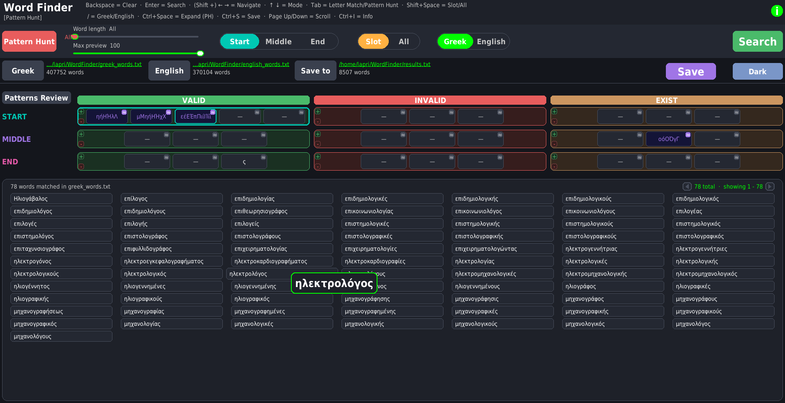
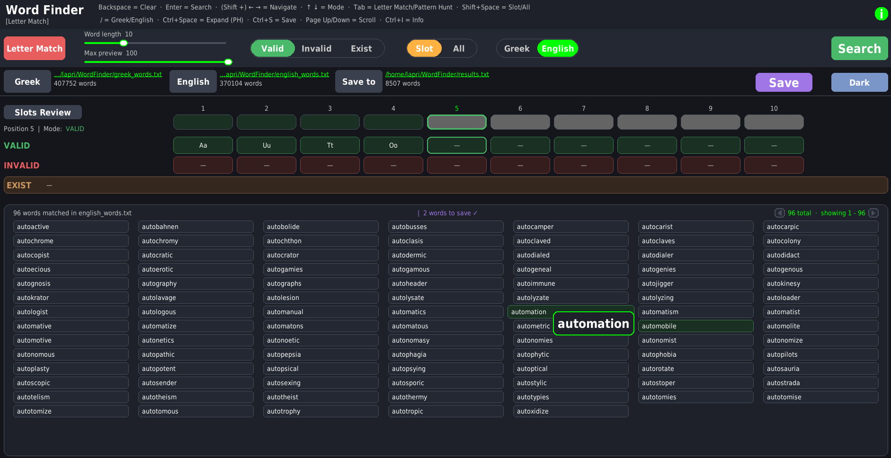

# Word Finder

Word Finder is a desktop word-filtering app for solving word games and experimenting with custom dictionary lists. It includes two search modes, supports **Greek** and **English** word lists, and can save filtered results to a text file.




## Features

- **Letter Match** mode for slot-based filtering
- **Pattern Hunt** mode for 3×3 pattern filtering
- Greek and English dictionary support
- Case and accent-aware matching logic
- Save filtered results to `results.txt` or any custom text file
- Light/Dark theme toggle
- Built with a PyGame interface and Tkinter file dialogs

## Requirements

- Python 3.10+ recommended
- `pygame`
- Standard library modules used by the app:
  - `tkinter`
  - `subprocess`
  - `collections`
  - `itertools`
  - `os`
  - `sys`

If `pygame` is not installed:

```bash
pip install pygame
```

## How to Run

From the project directory:

```bash
python WordFinder.py
```

## Word Lists

The app uses text files as word sources:

- `words/greek_words.txt` — Greek word list
- `words/english_words.txt` — English word list
- `words/wordle_dictionary.txt` — English words for wordle
- `words/results.txt` — output file for saved results

You can replace or edit these files with your own word lists, as long as they remain plain text files.

## Usage

### 1) Choose a language
Use the **Greek / English** toggle to switch between dictionaries.

### 2) Select a search mode
Use the red mode button or press **Tab** to switch between:

- **Letter Match**
- **Pattern Hunt**

### 3) Set filters
- Adjust **word length**
- Enter letter constraints
- Use the **Slot / All** toggle when needed
- Press **Enter** or click **Search**

### 4) Review and save
- Mark words to save or exclude from the result list
- Click **Save** to export the filtered list

## Controls

- **Enter** — Search
- **Tab** — Switch between Letter Match and Pattern Hunt
- **Shift + Space** — Toggle Slot / All
- **Ctrl + Space** — Expand/collapse Pattern Hunt slots
- **Ctrl + S** — Save results
- **Ctrl + I** — Open instructions
- **Page Up / Page Down** — Scroll results
- **/ (slash)** — Switch Greek / English
- **Backspace** — Clear selected input

## Legacy Files

The `old_files` folder contains earlier versions of the project:

- `WordFinder_1mode_old.py`
- `WordFinder_2modes_old.py`

## Notes

- The app is designed to work with plain text word lists.
- Matching behavior is customized for Greek letter variants and English case handling.
- The interface uses PyGame for rendering and Tkinter for file dialogs.

## Credits

This project was created with assistance from **Claude LLM**, and modified by me to implement the desirable functionalities and appearance.

## License

See the `LICENSE` file for details.
