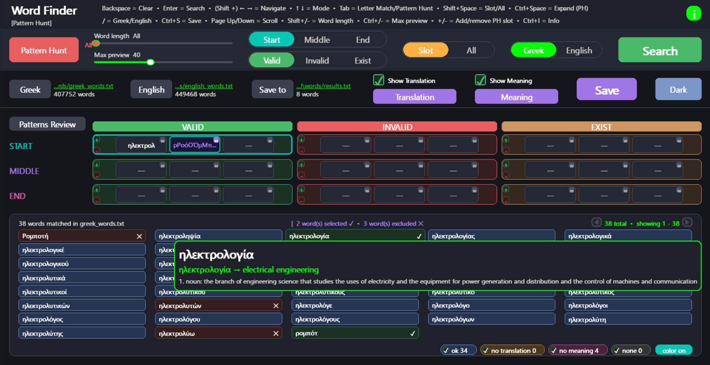
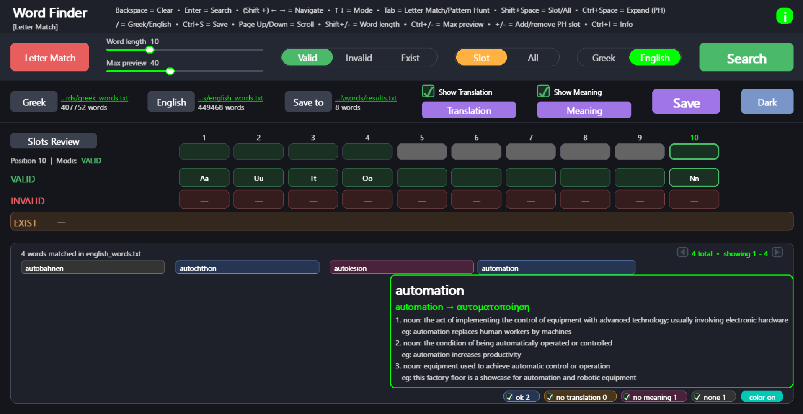
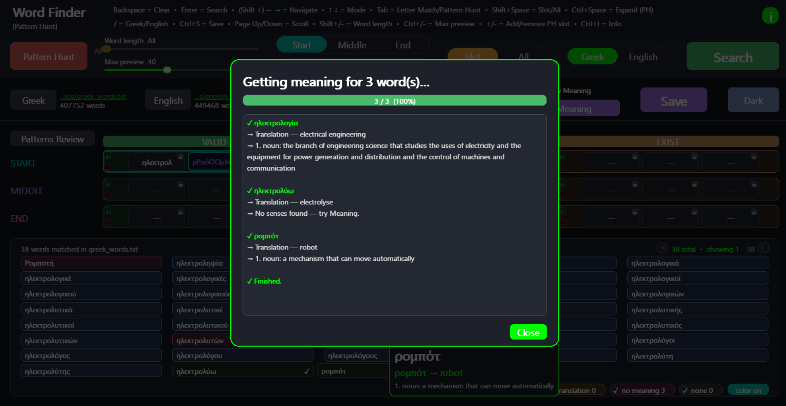
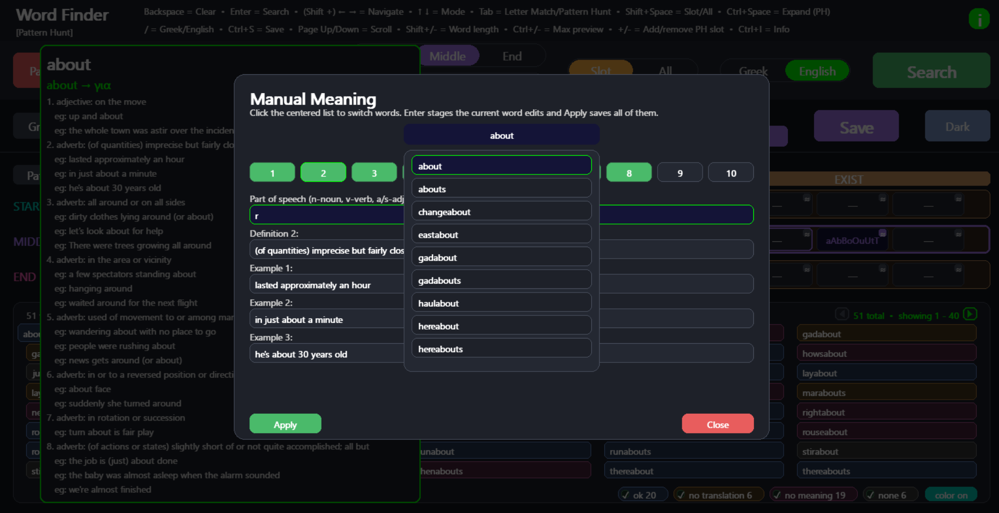
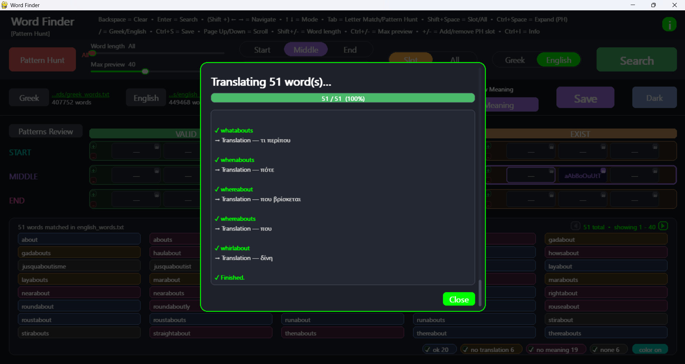
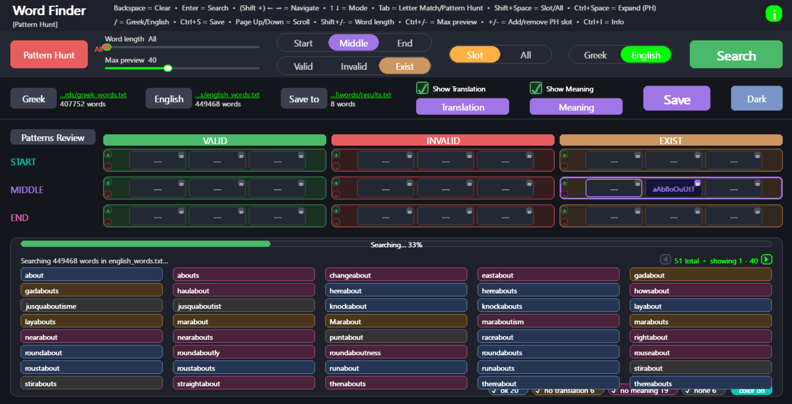
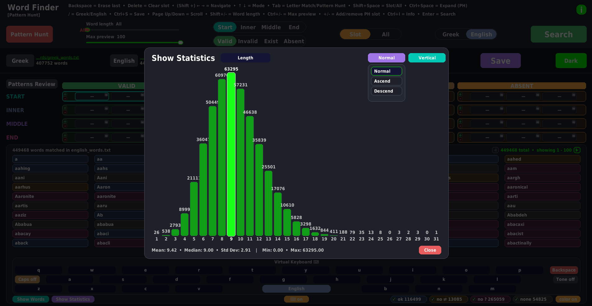
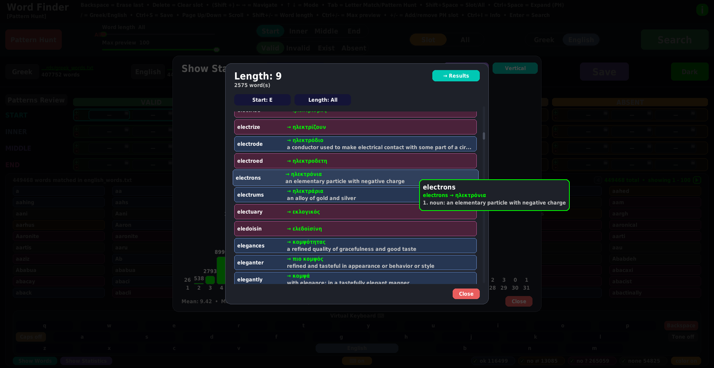

# Word Finder

Word Finder is a desktop word-filtering app for solving word games and experimenting with custom dictionary lists. It includes two search modes, supports **Greek** and **English** word lists, and can save filtered results to a text file. It also includes built-in translation and meaning enrichment tools, per-word status coloring, browsable word/statistics popups, and a scrollable in-app instructions guide.

<table>
  <tr>
    <td align="center">
      
    </td>
    <td align="center">
      
    </td>
  </tr>
  <tr>
    <td align="center">
      
    </td>
    <td align="center">
      
    </td>
  </tr>
  <tr>
    <td align="center">
      
    </td>
    <td align="center">
      
    </td>
  </tr>
  <tr>
    <td align="center">
      
    </td>
    <td align="center">
      
    </td>
  </tr>
</table>

## Features

- **Letter Match** mode for slot-based filtering, with four input modes per slot: Valid, Invalid, Exist, and Absent
- **Pattern Hunt** mode for grid-based filtering: a 4×4 grid of Start / Inner / Middle / End rows against Valid / Invalid / Exist / Absent columns
- Greek and English dictionary support
- Case-aware English matching and accent-aware Greek matching
- Per-word status coloring in the results panel (e.g. translated, missing translation, missing meaning) that can be toggled on or off
- Save filtered results to any custom text file
- **Translate** current results and save translations into the app's JSON data files
- **Get Meaning** for current results and save WordNet-style meanings for English words, with **Show Translation** / **Show Meaning** checkboxes that control what appears on hover in both the results panel and the Show Words popup
- Live progress modal for translation and meaning jobs, with per-word progress output showing the processed word and its result
- **Slots Review** / **Patterns Review** popup summarizing all current constraints for the active mode, with **Copy** (to the system clipboard) and **Close** buttons
- **Show Words** popup: browse the current result list with Start-letter and Length filters, inline translation/first-definition text per word, full hover detail (all saved senses, respecting the Show Translation/Show Meaning checkboxes), and a **→ Results** button to send the filtered list back into the results panel
- **Show Statistics** popup: bar charts over the current results (length, letters, letter position, vowel ratio, unique letters, first/last letter, n-grams), sortable and switchable between vertical/horizontal layout; every bar (including its value label, so even very small bars stay clickable) opens a Show Words-style popup listing exactly the words behind it
- Light/Dark theme toggle
- Built with a PyGame interface and Tkinter file dialogs

## Requirements

- Python 3.10+ recommended
- `pygame`
- Optional translation/meaning backends:
    - `deep_translator`
    - `nltk`
- Optional, for reliable clipboard copying from the Slots/Patterns Review popup:
    - `clip` (built into Windows)
    - `pbcopy` (built into macOS)
    - `xclip`, `xsel`, or `wl-copy` on Linux (falls back to Tkinter's clipboard if none are found)

- Standard library modules used by the app:
    - `tkinter`
    - `subprocess`
    - `collections`
    - `itertools`
    - `statistics`
    - `math`
    - `unicodedata`
    - `os`
    - `sys`
    - `json`
    - `threading`
    - `queue`
    - `platform`

If `pygame` is not installed:

```bash
pip install pygame
```

If you want translation and meaning features to work, install the optional packages too:

```bash
pip install deep-translator nltk
```

## How to Run

For the local setup, after cloning the repository, run the appropriate setup script once from the project directory.

- Linux / macOS

```bash
./setup_scripts/setup-local.sh
```

- Windows (Powershell)

```bash
.\setup_scripts\setup-local.ps1
```

If PowerShell blocks the script because of its execution policy, run:

```bash
powershell -ExecutionPolicy Bypass -File .\setup_scripts\setup-local.ps1
```

What the setup script does:

1. Extracts the JSON dictionaries required by the translation and meaning processes from their ".json.gz" archives.
2. Configures the local ".txt" and ".json" word and dictionary files using Git's "skip-worktree" setting.

To run the app, execute the command below:

```bash
python WordFinder.py
```

## Word Lists

The app uses text files as word sources:

- `words/greek_words.txt` — Greek word list
- `words/english_words.txt` — English word list
- `words/results.txt` — default output file for saved results

You can replace or edit these files with your own word lists, as long as they remain plain text files.

## Usage

### 1) Choose a language

Use the **Greek / English** toggle (or the **/** key) to switch between dictionaries.

### 2) Select a search mode

Use the red mode button or press **Tab** to switch between:

- **Letter Match** — set Valid, Invalid, Exist, and Absent letters per slot
- **Pattern Hunt** — set Valid, Invalid, Exist, and Absent letter sequences per Start / Inner / Middle / End row

### 3) Set filters

- Adjust **word length** (buttons, or **Shift + =** / **Shift + -**)
- Enter letter constraints
- Use the **Slot / All** toggle when needed
- Press **Enter** or click **Search**

### 4) Review and save

- Mark words to save or exclude from the result list
- Toggle status coloring, **Show Translation**, and **Show Meaning** to control what the results panel displays and shows on hover
- Open **Show Words** to browse/filter the current results, or **Show Statistics** to see them charted; either popup can send its word list back to the results panel via **→ Results**
- Click **Save** to export the filtered list

### 5) Enrich results

- Click **Translation** to manually write or automatically fetch translations for the current selection
- Click **Meaning** to manually write or automatically fetch meanings for the current selection
- Watch the progress modal for per-word output and completion status

### 6) Review your constraints

- Click **Slots Review** (Letter Match) or **Patterns Review** (Pattern Hunt) to see a full summary of the current mode's constraints, and use **Copy** to copy it to the clipboard

## Controls

- **Enter** — Search
- **Tab** — Switch between Letter Match and Pattern Hunt
- **Shift + Space** — Toggle Slot / All
- **Ctrl + Space** — Expand/collapse Pattern Hunt slots
- **Ctrl + S** — Save results
- **Ctrl + I** — Open instructions
- **Page Up / Page Down** — Scroll results
- **/ (slash)** — Switch Greek / English
- **Shift + =** / **Shift + -** — Increase / decrease word length
- **= / -** (Pattern Hunt only) — Increase / decrease the number of slots in the selected row/column
- **Ctrl + =** / **Ctrl + -** — Increase / decrease how many results are shown per page
- **Backspace** — Erase the last letter (Valid/Invalid) or last character of a sequence (Pattern Hunt); in Exist/Absent, deletes the selected item
- **Delete** — Fully clear the selected slot (or all slots, in "All" scope); in Exist/Absent, deletes the selected item

## Legacy Files

The `old_files` folder contains earlier versions of the project:

- `WordFinder_1mode_old.py`
- `WordFinder_2modes_old.py`

## Notes

- The app is designed to work with plain text word lists.
- Matching behavior is customized for Greek letter variants and English case handling.
- Translation and meaning features are loaded lazily so the app can still run without the optional enrichment packages.
- The interface uses PyGame for rendering, with Tkinter used for file dialogs (and as a clipboard fallback on systems without a native clipboard tool).
- Full in-app instructions are available any time via **Ctrl + I**, and stay up to date with the app's current controls and popups.

## Credits

This project was created with assistance from **ChatGPT** and **Claude LLM**, and modified by me to implement the desirable functionalities and appearance.

## License

See the `LICENSE` file for details.
